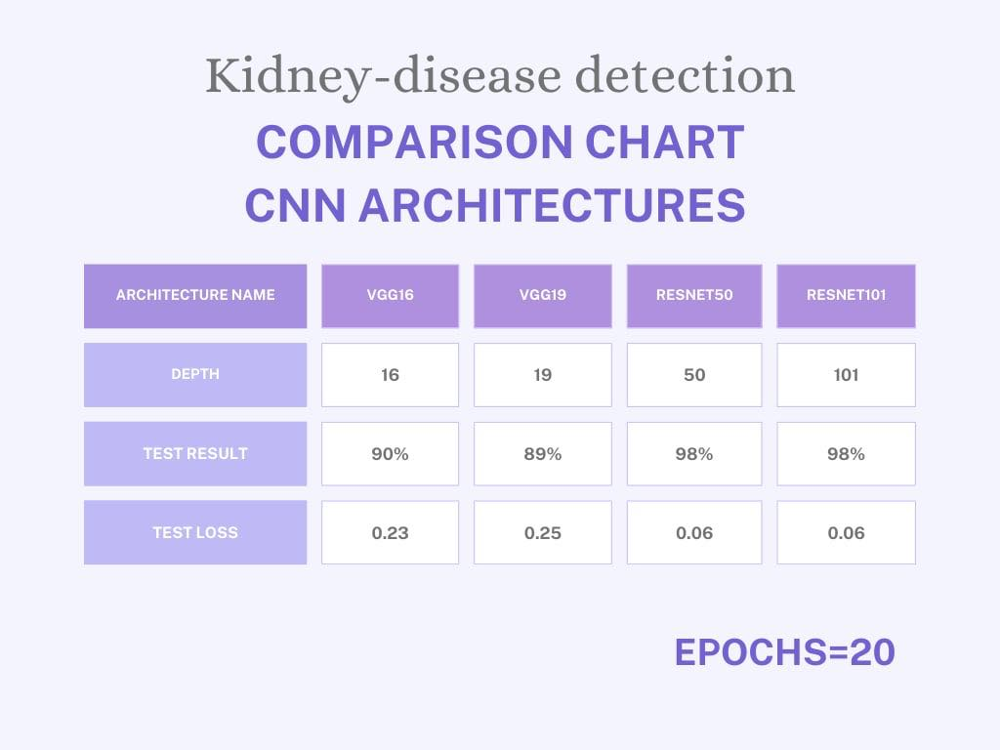

# Renal CT Scan Classification using Deep Learning

This project focuses on the classification of renal CT scans into four categories: **stone**, **tumor**, **cyst**, and **normal** using deep learning techniques.

## 🧠 Overview

We applied a **Convolutional Neural Network (CNN)** for classification and **YOLO (You Only Look Once)** for object detection. The workflow consists of:

1. **Database Collection**: We utilized a large CT scan database for renal diseases [(Database Kaggle Link)](https://www.kaggle.com/datasets/nazmul0087/ct-kidney-dataset-normal-cyst-tumor-and-stone).
   
2. **Data Preprocessing**:
   - The dataset was organized into four main classes: **Stone**, **Tumor**, **Cyst**, and **Normal**.
   - Each class was split into **training**, **validation**, and **test** sets.

3. **YOLO Model**:
   - YOLO was used to detect and localize both kidneys in each CT scan image.
   - The detected kidneys were cropped into two separate images, which served as the input for the classification model.

4. **Classification**:
   - The cropped kidney images were passed through the **CNN** model to predict the category: **Stone**, **Cyst**, **Tumor**, or **Normal**.

## 🔧 Technologies Used

- **CNN (Convolutional Neural Networks)** for disease classification.
- **YOLO (You Only Look Once)** for kidney detection and cropping.
- **Flask** for the backend server.
- **Vue.js** for the frontend interface.

## 🚀 Running the Project

### Backend (Flask)
- Install the required Python dependencies using `pip install -r requirements.txt`.
- Start the Flask server using `flask run`.

### Frontend (Vue.js)
- Navigate to the `frontend` directory.
- Install the dependencies using `npm install`.
- Run the Vue.js development server using `npm run dev`.

## 📊 Results
Through our experiments with various models, we observed significant improvements in classification accuracy. The CNN model achieved a robust performance, successfully distinguishing between the four classes with high precision, demonstrating the effectiveness of deep learning in medical imaging applications.

## 🖼️ User UI

